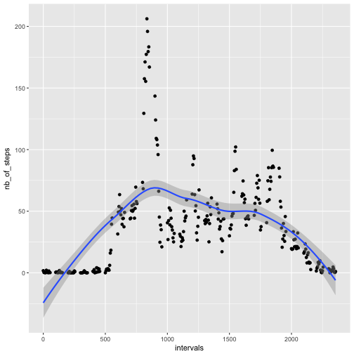
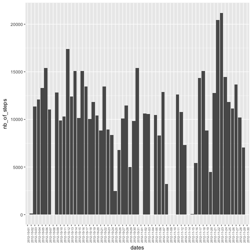

Peer-graded Assignment: Course Project 1
=========================================

Read the data needed for the analysis:
activity <- read.csv("Reproductible Research/Chapter 2/activity.csv")

```r
activity <- read.csv("activity.csv")
```

Loading the needed libraries for the exercise


```r
library(dplyr)
library(ggplot2)
```

add a new column in order to get the steps as numeric, then aggregate the steps using the aggregate function in order to get a new and cleaned database that will be used for the exercise


```r
activity2 <- mutate(activity,stepint=as.numeric(as.character(steps)))
stepsperday <- aggregate(activity2$stepint, by = list(activity2$date) , FUN=sum, na.rm=T)
colnames(stepsperday)[1] <- "dates"
colnames(stepsperday)[2] <- "nb_of_steps"
```

Create a histogram of the steps per day


```r
histstep <- ggplot(stepsperday, aes(dates,nb_of_steps))
histstep+geom_bar(stat="identity")+ theme(axis.text.x  = element_text(angle=90, size=6))
```


Mean and Median of the number of steps per day


```r
median1 <- median(stepsperday$nb_of_steps)
mean1 <- mean(stepsperday$nb_of_steps)

median1
```

```
## [1] 10395
```

```r
mean1
```

```
## [1] 9354.23
```

Create a new dataframe that will be used to determine the max number of steps for the 5 minutes interval


```r
stepsperincr <- aggregate(activity2$stepint, by = list(activity2$interval) , FUN=mean, na.rm=T)
colnames(stepsperincr)[1] <- "intervals"
colnames(stepsperincr)[2] <- "nb_of_steps"
```

Create a time series plot of the steps per 5 minutes increment


```r
seriesstep <- ggplot(stepsperincr, aes(intervals,nb_of_steps))
seriesstep+geom_point()+geom_smooth()
```

```
## `geom_smooth()` using method = 'loess'
```



Determine the maximum number of step in a 5 minutes increment and the increment it relates to


```r
stepsperincr[ stepsperincr$nb_of_steps == max( stepsperincr$nb_of_steps ) , ]
```

```
##     intervals nb_of_steps
## 104       835    206.1698
```

List the number of lines in the dataset and the number of lines with missing values


```r
sum(is.na(activity2))
```

```
## [1] 4608
```

##Method for filling the NAs:
*If NA, then assume 0 steps have been walked in this increment*


```r
activity3=activity2
activity3[is.na(activity3)] <- 0
```

Aggregate the steps on the new DF using the aggregate function in order to get a new and cleaned database that will be used for the exercise


```r
stepsperday2 <- aggregate(activity3$stepint, by = list(activity3$date) , FUN=sum, na.rm=T)
colnames(stepsperday2)[1] <- "dates"
colnames(stepsperday2)[2] <- "nb_of_steps"
```

Create a histogram of the steps per day on the new DF


```r
histstep <- ggplot(stepsperday2, aes(dates,nb_of_steps))
histstep+geom_bar(stat="identity")+ theme(axis.text.x  = element_text(angle=90, size=6))
```



Mean and Median of the number of steps per day


```r
median2 <- median(stepsperday2$nb_of_steps)
mean2 <- mean(stepsperday2$nb_of_steps)

median2
```

```
## [1] 10395
```

```r
mean2
```

```
## [1] 9354.23
```

```r
varmedian = median2 - median1
varmean = mean2 - mean1

varmedian
```

```
## [1] 0
```

```r
varmean
```

```
## [1] 0
```

Split the df between weekend and weekdays


```r
activity3 <- mutate(activity3,weekday=weekdays(as.Date(activity3$date), abbr = TRUE))
activity3 <- mutate(activity3,weekend=factor(1*(activity3$weekday=="Sat"|activity3$weekday=="Sun"), labels=c("weekdays","weekend")))
```

Build a graph showing the difference between weekend and weekdays activity (in number of steps)

```r
stepsperincrw <- aggregate(activity3$stepint, by = list(activity3$interval,activity3$weekend) , FUN=mean, na.rm=T)
colnames(stepsperincrw)[1] <- "intervals"
colnames(stepsperincrw)[2] <- "weekend"
colnames(stepsperincrw)[3] <- "nb_of_steps"
seriesstepw <- ggplot(stepsperincrw)
seriesstepw+geom_line(aes(intervals,nb_of_steps, color = stepsperincrw$weekend))
```


